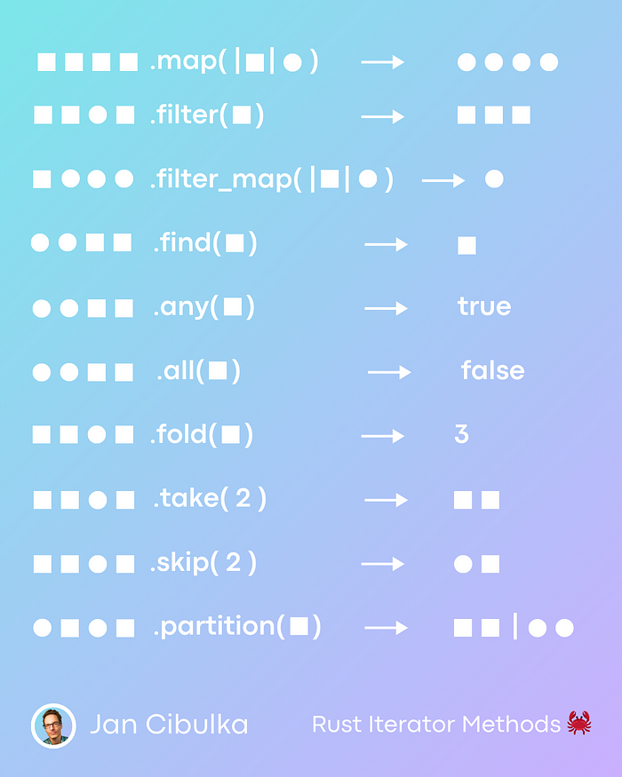

# 33 Most Useful Rust Iterator Methods

> **Source:** [33 Most Useful Rust Iterator Methods](https://freedium.cfd/https://medium.com/@jannden/33-most-useful-rust-iterator-methods-b56eb608de76)

Rust is very keen on collections. That's why it offers a useful set of methods for iterations. Maybe you haven't even heard of some of them, yet they are so elegant and powerful.

Here is a visual guide to the ten most important methods. I explain these 10 (and many more) in this article.



_Rust Iterator Methods Visually — an infographic by the [author](https://www.linkedin.com/in/jancibulka/)_

Just before we start, I want to clarify two topics related to iterators.

#### A) What's up with all the `iter` and `into_iter

In the upcoming examples, you will surely notice an extensive use of `iter` and `into_iter`. They turn a collection into a sequence of values that we can "loop over".

The choice between them depends on how you want to interact with the data:

- **`iter()`** borrows elements from the collection, allowing you to traverse them without taking ownership. This is useful when you don't want to modify or consume the collection, leaving it available for further use.
- **`into_iter()`**, on the other hand, consumes the collection, taking ownership of its elements. Once a collection is consumed, it can no longer be used. This makes sense when you want to transform or move the data out of the collection.

#### B) Lazy Evaluation of Iterators

An important feature of iterators in Rust is that they are **lazy by default**. This means methods like `.map()` and `.filter()` don't immediately execute their operations. Instead, they create a chain of iterator transformations that only run when the iterator is **consumed**—typically through methods like `.collect()`, `.sum()`, or `.count()`.

For example, in the following code, no actual computation is performed:

```rust
let squares = vec![1, 2, 3, 4].iter().map(|x| x * x);
```

To trigger the computation, you would use a consuming method like `.collect()`:

```rust
let squares: Vec<_> = squares.collect();
```

With these two concepts out of the way, let's finally look at the 33 most useful Rust iterator methods!

### .map(|x| f(x))

The `.map` method applies a closure to each element in an iterator, transforming each element according to that closure.

```rust
let numbers = vec![1, 2, 3, 4];

// Results in: [1, 4, 9, 16]
let squares = numbers.iter().map(|x| x * x).collect::<Vec<_>>();
```

**When to Use**: Use `.map` when you need to transform each item of a collection into something else.

**Example**: Converting temperatures from Celsius to Fahrenheit.

### .filter(|x| condition(x))

`.filter` selects elements from an iterator based on a condition. Only elements for which the condition returns `true` are kept.

```rust
let numbers = vec![1, 2, 3, 4];

// Results in: [2, 4]
let even_numbers = numbers.iter().filter(|&x| x % 2 == 0).collect::<Vec<_>>();
```

**When to Use**: Use `.filter` when you need to keep only the elements that match a certain condition.

**Example**: Filtering a list of students by those who passed an exam.

### .filter_map(|x| f(x))

`.filter_map` applies a function that returns an `Option<T>` to each element in a vector. It filters out `None` values and unwraps the `Some` values.

```rust
let strings = vec!["1", "two", "3", "four"];

// Results in: [1, 3]
let numbers: Vec<i32> = strings.into_iter().filter_map(|s| s.parse().ok()).collect();
```

**When to Use**: Use `.filter_map` when you need to transform and filter elements of a collection simultaneously.

**Example**: Parsing strings into numbers, ignoring invalid formats.

### .find(|x| condition(x))

`.find` searches for an element in a vector that satisfies a condition. It returns the first element that matches the condition.

```rust
let numbers = vec![1, 2, 3, 4];
// Results in: Some(2)
let first_even = numbers.iter().find(|&x| x % 2 == 0);
```

**When to Use**: Use `.find` when you're looking for an element that matches a condition.

**Example**: Finding the first item in a list that is out of stock in a store inventory.

### .any(|x| condition(x))

`.any` checks if any element in a vector satisfies a condition. It returns `true` if at least one element meets the condition.

```rust
let numbers = vec![1, 3, 5, 7];

// Results in: false
let has_even = numbers.iter().any(|&x| x % 2 == 0);
```

**When to Use**: Use `.any` when you want to check if there's at least one element that matches a condition.

**Example**: Checking if any product is below the minimum stock level.

### .all(|x| condition(x))

`.all` checks if all elements in a vector satisfy a condition. It returns `true` only if every element meets the condition.

```rust
let numbers = vec![2, 4, 6, 8];

// Results in: true
let all_even = numbers.iter().all(|&x| x % 2 == 0);
```

**When to Use**: Use `.all` when you need to ensure that every element in a collection matches a condition.

**Example**: Verifying that all items in a shipment meet quality standards.

### .fold(initial, |acc, x| operation(acc, x))

`.fold` reduces a vector to a single value by applying a function to each element and an accumulator.

```rust
let numbers = vec![1, 2, 3];

// Results in: 6
let sum = numbers.iter().fold(0, |acc, x| acc + x);
```

**When to Use**: Use `.fold` when you need to aggregate elements of a collection into a single value.

**Example**: Calculating the total price of items in a shopping cart.

### .skip(n)

`.skip` creates an iterator that skips the first `n` elements of a vector and yields the rest.

```rust
let numbers = vec![1, 2, 3, 4];

// Results in: [3, 4] let after_skip: Vec<_> = numbers.into_iter().skip(2).collect();
```

**When to Use**: Use `.skip` when you want to ignore the first `n` elements and process the rest.

**Example**: Skipping the header row in a CSV file to process the data rows.

### .take(n)

`.take` creates an iterator that yields the first `n` elements from a vector.

```rust
let numbers = vec![1, 2, 3, 4];

// Results in: [1, 2]
let first_two: Vec<_> = numbers.into_iter().take(2).collect();
```

**When to Use**: Use `.take` when you need only the first `n` elements of a collection.

**Example**: Displaying the top 2 high scores from a list of game scores.

### .take_while(predicate)

`.take_while` creates an iterator that yields elements from a collection as long as the predicate condition is true. Once the condition is false, it stops yielding elements.

```rust
let numbers = vec![1, 2, 3, 4, 0, 5, 6];

// Results in: [1, 2, 3, 4]
let until_zero: Vec<_> = numbers.into_iter().take_while(|&x| x != 0).collect();
```

**When to Use**: Use `.take_while` when you need elements from a collection until a certain condition is met, rather than a fixed number of elements.

**Example**: Reading lines from a TCP stream until an empty line is encountered, which is often used to read the headers of an HTTP request.

### .partition(|x| condition(x))

`.partition` divides a vector into two vectors based on a condition. One vector contains elements that match the condition, and the other contains the rest.

```rust
let numbers = vec![1, 2, 3, 4];

// Results in: ([2, 4], [1, 3])
let (even, odd): (Vec<_>, Vec<_>) = numbers.into_iter().partition(|&x| x % 2 == 0);
```

**When to Use**: Use `.partition` when you need to separate elements of a collection based on a condition.

**Example**: Separating orders into express and standard delivery based on delivery time preference.

### .enumerate()

The `.enumerate` method adds a counter to an iterator, returning a tuple containing the count and the value. This is particularly useful when you need both the index and the value of elements in a loop.

```rust
let letters = vec!['a', 'b', 'c'];

// Results in: [(0, 'a'), (1, 'b'), (2, 'c')]
let with_index: Vec<_> = letters.iter().enumerate().collect();
```

**When to Use**: Use `.enumerate` when you need to keep track of the index of elements while iterating through a collection.

**Example**: Assigning unique IDs to items in a list.

### .zip()

`.zip` combines two iterators into a single iterator of tuples. Each tuple contains one element from each of the iterators. Iteration stops when the shortest iterator is exhausted.

```rust
let names = vec!["Alice", "Bob", "Charlie"]; let scores = vec![88, 92, 95];

// Results in: [("Alice", 88), ("Bob", 92), ("Charlie", 95)]
let paired: Vec<_> = names.iter().zip(scores.iter()).collect();
```

**When to Use**: Use `.zip` when you want to combine elements from two collections into pairs.

**Example**: Pairing student names with their test scores.

### .chunks(n)

`.chunks` splits a vector into slices (not to be confused with separate vectors) of `n` elements each, except for the last one, which may be smaller. This method is useful for processing parts of a collection in groups.

```rust
let numbers = vec![1, 2, 3, 4, 5];

// Results in: [[1, 2], [3, 4], [5]]
let chunked: Vec<_> = numbers.chunks(2).collect();
```

**When to Use**: Use `.chunks` when you need to process or examine a collection in smaller, more manageable segments.

**Example**: Processing data in batches to reduce memory usage.

### .flat_map(|x| f(x))

`.flat_map` applies a function to each element of an iterator and flattens the result. The function returns an iterator and `.flat_map` combines these iterators into one.

```rust
let nested_vecs = vec![vec![1, 2, 3], vec![4, 5, 6]];

// Results in: [1, 2, 3, 4, 5, 6]
let flattened: Vec<_> = nested_vecs.into_iter().flat_map(|x| x.into_iter()).collect();
```

**When to Use**: Use `.flat_map` when you want to transform and flatten nested structures into a flat collection.

**Example**: Flattening a list of responses from multiple API calls into a single list.

### .cloned()

`.cloned` creates an iterator that clones each element of the original iterator. This is particularly useful when working with iterators over references and you need owned data instead.

```rust
let numbers_ref = vec![&1, &2, &3];

// Results in: [1, 2, 3]
let numbers: Vec<_> = numbers_ref.into_iter().cloned().collect();
```

**When to Use**: Use `.cloned` when you need to convert an iterator of references into an iterator of owned values.

**Example**: Cloning references to actual values for modification or transfer of ownership.

### .collect::<Vec<_>>()

`.collect` is a versatile method used to convert an iterator back into a collection. While `.collect` can be used to create various collection types, it's frequently used to gather items into a `Vec` — and works with other types like `HashMap` and `HashSet`, too.

```rust
let numbers_iter = 1..=5;

// Results in: [1, 2, 3, 4, 5]
let numbers: Vec<_> = numbers_iter.collect();
```

**When to Use**: Use `.collect` to transform an iterator into a collection, such as when you're done filtering, mapping, or otherwise processing data.

**Example**: Gathering filtered results into a vector for further use.

### .extend(iter)

`.extend` adds elements from an iterator to the end of the collection. This method is useful for concatenating two collections together.

```rust
let mut vec1 = vec![1, 2, 3]; let vec2 = vec![4, 5, 6];

// vec1 will be: [1, 2, 3, 4, 5, 6]
// vec2 will be consumed (moved) vec1.extend(vec2);
```

**When to Use**: Use `.extend` when you want to add elements from one collection into another.

**Example**: Merging two lists of attendees from different events.

### .chain(iter)

`.chain` concatenates two iterators into a new one, allowing you to iterate over two sequences as if they were a single sequence.

```rust
let vec1 = vec![1, 2, 3]; let vec2 = vec![4, 5, 6];

// Results in: [1, 2, 3, 4, 5, 6]
let chained: Vec<_> = vec1.iter().chain(vec2.iter()).collect();
```

**When to Use**: Use `.chain` when you want to iterate over two collections sequentially as one continuous iterator.

**Example**: Concatenating two lists of attendees from separate events into one.

### .max()

The `.max` method finds the maximum element in an iterator. When used on a collection, it returns the largest item according to the item's natural ordering or a custom comparator if provided.

```rust
let numbers = vec![10, 30, 25, 60, 40];

// Results in: Some(60)
let max_number = numbers.iter().max();
```

**When to Use**: Use `.max` when you need to find the largest item in a collection.

**Example**: Finding the highest score in a game.

### .min()

Conversely, `.min` finds the minimum element in an iterator, returning the smallest item based on its natural ordering.

```rust
let numbers = vec![10, 30, 25, 60, 40];

// Results in: Some(10)
let min_number = numbers.iter().min();
```

**When to Use**: Use `.min` to locate the smallest item in a collection.

**Example**: Determining the lowest price among products.

### .count()

`.count` consumes the iterator to count the number of elements, returning the total count. This method is useful for quickly determining the size of a collection after filtering or other transformations.

```rust
let words = vec!["rust", "cargo", "crates", "modules"];

// Results in: 4
let count = words.iter().count();
```

**When to Use**: Use `.count` when you need to know the number of elements in an iterator.

**Example**: Counting the number of completed tasks in a list.

### .sum()

`.sum` aggregates the elements of an iterator by summing them up. This method is especially handy for numeric collections.

```rust
let numbers = vec![5, 10, 15, 20];

// Results in: 50
let total: i32 = numbers.iter().sum();
```

**When to Use**: Use `.sum` when you need to calculate the total of numeric values in a collection.

**Example**: Summing up the total amount of sales in a day.

### .product()

Similar to `.sum`, `.product` multiplies all elements of an iterator together, returning the product.

```rust
let numbers = vec![2, 3, 4];

// Results in: 24
let result: i32 = numbers.iter().product();
```

**When to Use**: Use `.product` to calculate the product of all numeric values in a collection.

**Example**: Calculating the total combinations of a set of options.

### .nth(n)

`.nth` returns the `n`th element of an iterator. It's a handy method for accessing an element at a specific position, especially after applying transformations.

```rust
let numbers = vec![1, 2, 3, 4, 5];

// Results in: Some(3)
let third_number = numbers.iter().nth(2);
```

**When to Use**: Use `.nth` when you need to retrieve an element at a specific index from an iterator.

**Example**: Fetching a specific ranking position from a leaderboard.

### .next()

The `.next()` method is used to retrieve the next item from an iterator. Each call to `.next()` consumes an item from the iterator, advancing its internal state. This behavior allows for iteration over collections in a controlled, sequential manner.

```rust
let mut numbers = vec![1, 2, 3].into_iter();

let first = numbers.next();
// Some(1)

let second = numbers.next();
// Some(2)

let third = numbers.next();
// Some(3)

let fourth = numbers.next();
// None
```

**When to Use**: The `.next()` method is particularly useful in scenarios where you need to iterate over elements one at a time, allowing for both simple and complex conditional logic to be applied at each step. It's the backbone of manual iteration in Rust, providing the control needed for detailed data processing tasks.

**Example:** Many algorithms require step-by-step processing of data. `.next()` enables precise control over this process, allowing algorithms to be implemented cleanly and efficiently.

### .last()

`.last` consumes the iterator to return the last element. This is particularly useful when you're interested in the final item after a series of transformations or filters.

```rust
let messages = vec!["Hello", "Rust", "World"];

// Results in: Some("World")
let last_message = messages.iter().last();
```

**When to Use**: Use `.last` to get the final element of a collection.

**Example**: Displaying the most recent message in a chat application.

### .cycle()

`.cycle` creates an iterator that repeats the original iterator indefinitely. This can be particularly useful when you need to repeat a sequence of elements multiple times.

```rust
let numbers = vec![1, 2, 3];

// Results in: [1, 2, 3, 1, 2, 3]
let cyclical: Vec<_> = numbers.iter().cycle().take(6).collect();
```

**When to Use**: Use `.cycle` when you need an endless repetition of the given elements. Be cautious to combine it with methods like `.take` to prevent infinite loops.

**Example**: Generating a repeating background pattern for a game level.

### .step_by(n)

`.step_by` skips `n - 1` elements in the iterator for each call, effectively stepping by `n` through the sequence. This method is handy for sampling or skipping elements at regular intervals.

```rust
let numbers = vec![1, 2, 3, 4, 5];

// Results in: [1, 3, 5]
let stepped = numbers.iter().step_by(2).collect::<Vec<_>>();
```

**When to Use**: Use `.step_by` when you want to iterate over a sequence while skipping a fixed number of elements between each.

**Example**: Sampling every other data point from a large dataset for analysis.

### .rev()

`.rev` reverses an iterator, allowing you to iterate over the elements in reverse order. This is particularly useful when you need to process elements starting from the end.

```rust
let numbers = vec![1, 2, 3, 4, 5];

// Results in: [5, 4, 3, 2, 1]
let reversed: Vec<_> = numbers.iter().rev().collect();
```

**When to Use**: Use `.rev` when you need to reverse the order of iteration, which is common in algorithms that rely on processing elements from the end.

**Example**: Reversing the order of characters in a string or elements in a list.

### .peekable()

`.peekable` transforms an iterator into a peekable iterator, allowing you to look at the next element without consuming it. This is useful when you need to make decisions based on the upcoming element without advancing the iterator.

```rust
let numbers = vec![1, 2, 3];
let mut peekable = numbers.iter().peekable();
if peekable.peek() == Some(&&2) {
    // Do something without advancing the iterator
}
```

**When to Use**: Use `.peekable` when your iteration logic depends on knowing the next item without moving the iterator forward.

**Example**: Parsing a token stream where decisions depend on the next token.

### .by_ref()

`.by_ref` borrows an iterator, allowing for partial consumption of an iterator within a scope. After the scope, you can continue using the original iterator. This method is handy when you want to apply different iteration patterns to the same collection without taking ownership.

```rust
let mut numbers = vec![1, 2, 3, 4].into_iter();

let sum_first_two: i32 = numbers.by_ref().take(2).sum(); // 3

let sum_rest: i32 = numbers.sum(); // 7
```

**When to Use**: Use `.by_ref` to perform temporary, partial iterations without consuming the entire iterator, allowing for further use.

**Example**: Applying different filters or operations to parts of a collection in stages.

### .is_sorted()

`.is_sorted` and `.is_sorted_by()` check if an iterator yields elements in non-decreasing order. It is useful for validations and assertions in algorithms that require or assume sorted data.

```rust
let numbers = vec![1, 2, 2, 3];

// Results in: true
let is_sorted = numbers.iter().is_sorted();
```

**When to Use**: Use `.is_sorted` when you need to verify that a sequence is ordered, either as a precondition for algorithms that depend on sorted data or as a postcondition to ensure sorting is successful.

**Example**: Ensuring a list of user IDs is sorted before performing a binary search.

### That's it!

These were the most often used iterator methods.

No need to learn them by heart, just know that they are at your disposal. Refer to this article anytime you need.